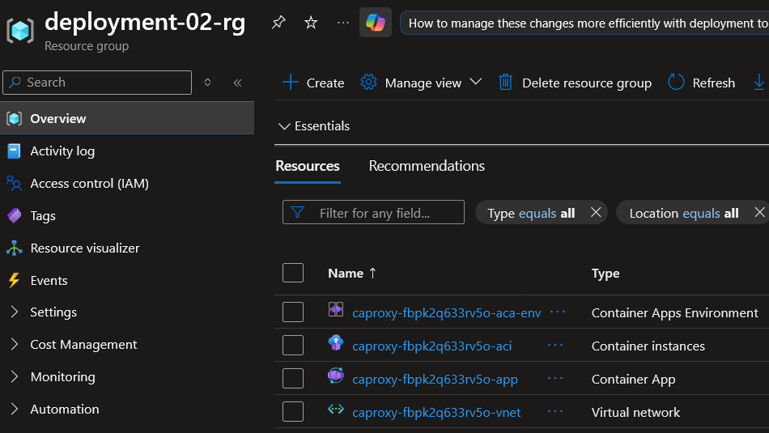
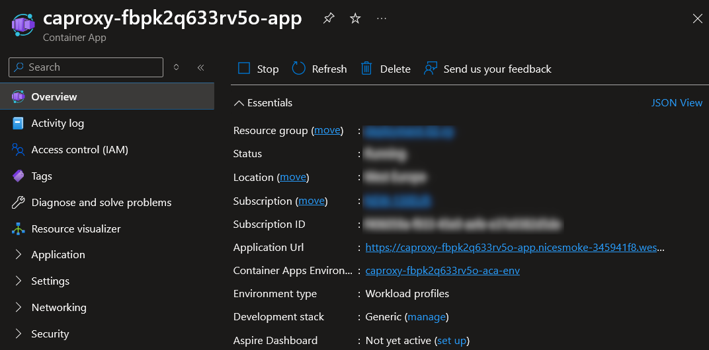
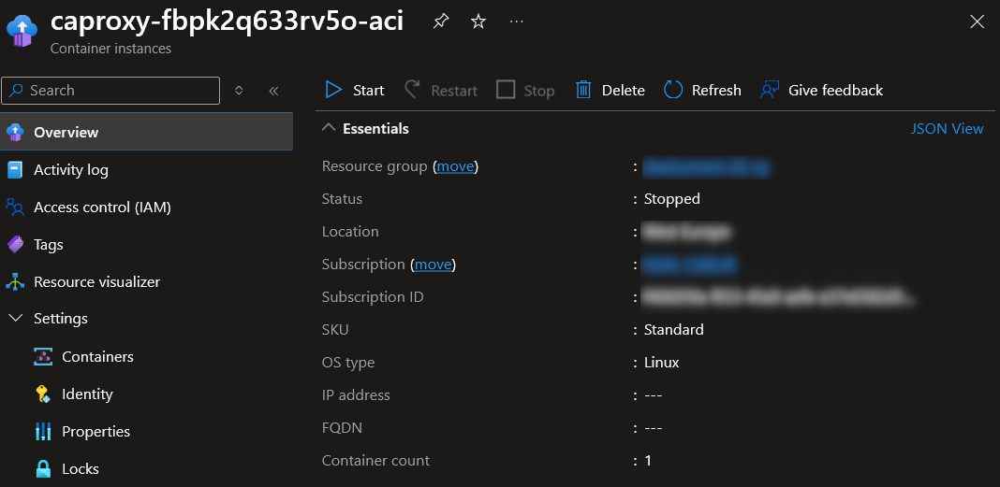
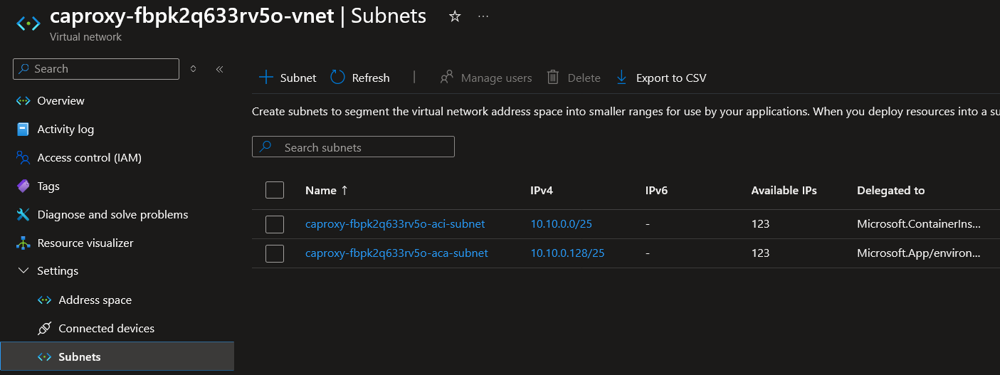

# Using Azure Container Apps as a Reverse Proxy

## Introduction

This project demonstrates a practical pattern for exposing a private containerized backend through a public HTTPS endpoint without giving the backend direct internet access.

The design uses **Azure Container Apps** as the public entry point and **Azure Container Instances** as the private backend runtime. A small reverse proxy written in Go runs inside the Container App, receives incoming requests, and forwards them to a backend container group running inside a virtual network. Azure Container Apps supports managed ingress for HTTP and HTTPS traffic, while Azure Container Instances provides a simple way to run isolated containers without managing virtual machines or a full orchestrator. The infrastructure is deployed as code by using a single ARM template.

## Prerequisites

To run the deployment, you will need an active Azure subscription.

## Architecture Overview

### What this pattern solves

The main problem is simple: you want a backend service to stay private, but you still need users or external systems to reach it through a secure public endpoint.

Instead of exposing the backend directly, this design places a reverse proxy in front of it. The proxy becomes the only internet-facing component. The backend stays inside the virtual network and accepts traffic only from the proxy side of the architecture.

### Why Azure Container Apps is the public entry point

Azure Container Apps is a good fit for the gateway role because it can expose an application through managed ingress without requiring you to create and manage extra load-balancing infrastructure yourself. It supports external and internal ingress modes, TLS termination for HTTPS endpoints, and revision-based deployment behavior, which makes it well suited for a small public-facing proxy service.

In this project, Azure Container Apps hosts the Go reverse proxy and provides the public endpoint that clients call first.

### Why Azure Container Instances is the private backend

Azure Container Instances is a good fit for the backend role because it provides a lightweight way to run isolated containers without setting up VMs or a higher-level orchestration platform. It also supports deployment into a virtual network, which allows the backend to stay private while still being reachable from the proxy.

In this project, the backend application runs as an ACI container group inside the VNet and does not expose a public endpoint.

### How the two services work together

The solution separates responsibilities clearly:

- **Azure Container Apps** handles public ingress and runs the reverse proxy
- **Azure Container Instances** runs the private backend workload
- **the virtual network** provides private communication between the proxy and the backend
- **the managed identity** allows the proxy to interact with Azure control-plane APIs without storing credentials in code or configuration

This creates a clean split between the **public edge** and the **private runtime**.

## Practical Implementation

### Infrastructure Deployment

The infrastructure is deployed with [the ARM template](arm.json).The template creates the resources required for the public-to-private proxy pattern. Proxy Container App runs [the Docker image](Dockerfile) which spins [Golang app](main.go) that forwards requests to the Container Instances. 

To start the deployment use the button below:

<a href="https://portal.azure.com/#create/Microsoft.Template/uri/https%3A%2F%2Fraw.githubusercontent.com%2Fgroovy-sky%2Fazure%2Frefs%2Fheads%2Fmaster%2Fcontainer-app-proxy%2Farm.json" target="_blank">
  
</a>

#### Virtual Network

First, the deployment creates a virtual network.

The network contains two subnets - one for Container Apps and one for Container Instances.

This separation allows the public proxy and the private backend to communicate over private networking while keeping the backend isolated from direct internet access.

#### Container Instance (backend)

Next, a container group is deployed into the ACI subnet.

This container group runs the backend application. It has no public IP address and is intended to be reachable only through the virtual network.

Because the backend is private, internet clients cannot access it directly.

#### Container App (proxy)

Finally, a Container App is deployed into the Container Apps subnet.

The final runtime component is the proxy application deployed to Azure Container Apps.

The proxy is exposed through external ingress, which makes it the public interface of the system. The Container App is assigned a **system-assigned managed identity**, which lets the proxy authenticate to Azure services without embedding secrets or credentials.

### Runtime Flow

Inside the Container App, a Go application runs as a reverse proxy.

The request path looks like this:

```text
Internet Client
    |
    | HTTPS
    v
[Go Reverse Proxy in Azure Container Apps]
    |
    | HTTP over private virtual network
    v
[Azure Container Instances backend]
```

When a request arrives, the proxy performs the following steps:

1. Accept the incoming HTTPS request on the public Container Apps endpoint.
2. Use its managed identity to authenticate to Azure.
3. Check the state of the target ACI container group.
4. If the backend is not running, start the container group.
5. Wait until the backend becomes reachable.
6. Discover the backend’s current private IP address if needed.
7. Forward the original request to the backend over the virtual network.

This keeps the backend private while allowing the proxy to act as a controlled public gateway.

## Result

After deployment, the system provides following architecture:




Users can call acess Azure Container Apps publicly:



After Container Apps receives the request it finds and starts the backend container group if it is not already running, then forwards the request over the private virtual network to the backend:



Azure Container App uses VNet integration to communicate with Container Instances:



The result is a simple separation between **internet-facing access** and **private backend execution**.

## Summary

This project combines Azure Container Apps and Azure Container Instances into a reusable access pattern for private backend services.

Azure Container Apps acts as the public-facing reverse proxy with managed HTTPS ingress. Azure Container Instances runs the backend workload inside a virtual network. A managed identity allows the proxy to interact with Azure without storing credentials, and the ARM template makes the whole setup deployable as code. 

The key idea is straightforward: **keep the backend private, and expose only the proxy**.
