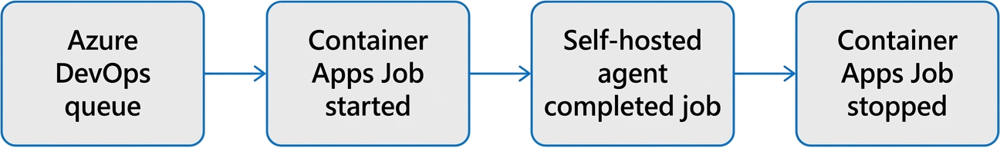
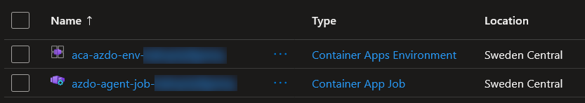
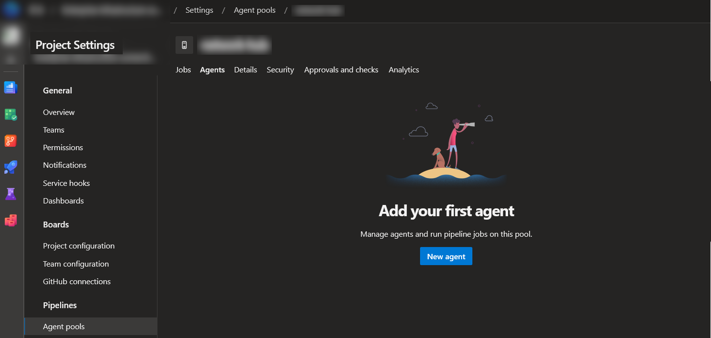
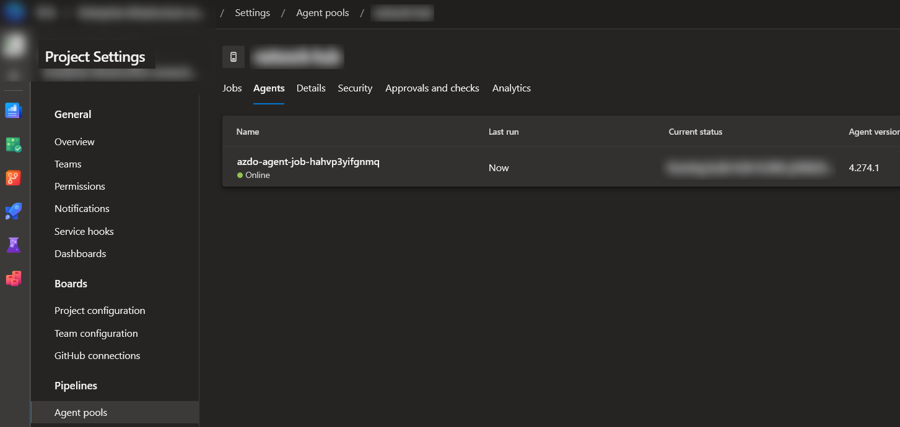

#  Running a self-hosted Azure DevOps agent in a Azure Container Apps job

## Introduction

Azure DevOps pipelines need build agents to execute CI/CD jobs. Microsoft-hosted agents are the default option, and they work well for many teams. However, they can be limiting when you need custom tooling, access to private networks, specialized dependencies, or tighter control over the build environment. Azure Pipelines also assigns jobs to agents one job at a time, so scaling the number of available agents matters when multiple builds are queued. 

A common alternative is to use self-hosted agents. In [the previous article](../devops-docker-build-00/README.md), the agent was run on Azure Container Instance. That approach works, but it has one main disadvantage: the container instance runs all the time, so you pay for compute even when no pipeline jobs are queued and the agent is idle.



A more efficient pattern is to run the Azure Pipelines agent inside a container and execute it as an **event-driven Azure Container Apps job**. This avoids the always-on cost model from Container Instance because the platform starts agent containers only when pipeline work is queued and stops them when the work is done. Azure Container Apps jobs are designed for workloads that start, run for a finite duration, and then stop, which matches self-hosted CI/CD agents well.

## Important notice

Before you implement this pattern, be aware of one major constraint: **Container Apps jobs do not support running Docker inside the container**. That means any pipeline step that depends on Docker commands such as `docker build`, `docker run`, or similar nested-container behavior will fail on this type of agent. Azure Pipelines also documents that nested containers are not supported when the agent itself is already running inside a container.

If your pipelines need Docker-in-Docker, privileged containers, or host-level Docker access, this design is not the right fit. In those cases, use another self-hosted agent model such as virtual machines or another runtime that can provide Docker on the host. 

## Theoretical Part

This tutorial shows how to build scalable Azure DevOps build infrastructure with these components:

- Azure DevOps self-hosted build agents
- Docker containers for packaging the agent environment
- Azure Container Apps Jobs for running agents on demand
- Event-driven scaling based on Azure Pipelines queue activity

### Azure DevOps self-hosted build agents

An Azure DevOps build agent is a worker process that executes pipeline tasks. Agents connect to Azure DevOps through an agent pool and wait for work. When a pipeline run needs a self-hosted agent, Azure DevOps selects an available agent in the target pool and assigns the job to it. Each agent handles one job at a time.

Self-hosted agents are useful when you need:

- custom tools or SDKs
- access to internal services or private networks
- control over the operating environment
- predictable build dependencies

This is the main reason teams move away from Microsoft-hosted agents for specialized workloads.

### Why run the agent in a container

Running the Azure Pipelines agent in a container makes the build environment reproducible. Instead of configuring a VM by hand, you define the agent image once and reuse it everywhere. Azure DevOps provides official guidance for running self-hosted agents in Docker, including Linux-based agent containers for orchestrated environments.

This gives you a few practical benefits:

- the agent environment is versioned in a Dockerfile
- new agents start from a known-good image
- tool installation becomes part of the image build
- replacing agents is easier because the runtime is disposable

In other words, the container becomes the build environment. If your pipelines need specific CLIs, language runtimes, or internal certificates, you add them to the image instead of maintaining long-lived machines. 

### How event-driven scaling works in Azure Container Apps

This implementation is based on **Azure Container Apps Jobs**, not a Kubernetes deployment you manage yourself. In Azure Container Apps, a job is meant for work that starts, runs for a finite duration, and then exits. Jobs can be triggered manually, on a schedule, or by events. Microsoft specifically documents self-hosted Azure Pipelines agents as a valid use case for the **event-driven job** model.

The scaling flow looks like this:

1. A pipeline is triggered in Azure DevOps.
2. The job enters the selected self-hosted agent pool.
3. The event-driven job detects queued work for that pool.
4. Azure Container Apps starts one or more job executions.
5. Each execution runs a containerized Azure Pipelines agent.
6. After the work completes and the queue drains, executions stop.

## Prerequisites

Before starting deployment, make sure you have:

- an Azure subscription
- an Azure DevOps project with an Azure DevOps agent pool
- a Personal Access Token (PAT) with **Agent Pools (Read & manage)** scope

## Practical Part

To be able to deploy the solution, you'll need:
0. Deploy Docker image of Azure Devops agent.
1. Create PAT in Azure DevOps with **Agent Pools (Read & manage)** scope.
2. Deploy Azure Container Apps Job with the agent container image and PAT.

### Docker Image
If need you can build and publish your own container image. For this demo will be used ghcr.io/groovy-sky/devops-agent:latest image, based on [the following Dockerfile](https://github.com/groovy-sky/docker-devops-agent/blob/master/docker/Dockerfile).

### PAT 

This deployment uses an Azure DevOps PAT for two purposes:

- registering the self-hosted agent in the target agent pool
- allowing the queue-driven scaling logic to authenticate against Azure DevOps

For agent registration, Microsoft documents that the PAT scope should be **Agent Pools (Read & manage)**.

Create the PAT in Azure DevOps:

1. Go to **User settings** -> **Personal access tokens**.
2. Generate a new token.
3. Select **Agent Pools (Read & manage)**.
4. Save the token value securely for deployment.

A single PAT can be reused to register multiple agents, and Azure DevOps states that the PAT is used during agent registration rather than for ongoing agent communication after registration. In an ephemeral container-based design, that registration step may happen repeatedly as fresh agents start.

### Container Apps Job deployment

All necessary resources are created using one [ARM template](arm.json). 

You can deploy the template directly from the Azure Portal:

<a href="https://portal.azure.com/#create/Microsoft.Template/uri/https%3A%2F%2Fraw.githubusercontent.com%2Fgroovy-sky%2Fazure%2Frefs%2Fheads%2Fmaster%2Fdevops-docker-build-01%2Farm.json" target="_blank">  </a>


Alternatively, you can deploy the template using Azure CLI:

```bash
az deployment group create \
  --resource-group <RESOURCE_GROUP> \
  --template-file arm.json \
  --parameters \
    azpUrl=https://dev.azure.com/<AZDO_ORG> \
    azpPool=<AZDO_POOL_NAME> \
    azpToken=<AZDO_PAT> \
    containerImage=<REGISTRY/IMAGE:TAG>
```

## Result

After deployment, you should have an Azure Container Apps Job and an Azure Container Apps environment:



If you inspect the agent pool in Azure DevOps, you should see nothing:



Only after a pipeline run is queued will the job start an execution and register a temporary agent in the pool:



If the setup is working correctly, the expected behavior is:

- a pipeline run enters the target agent pool
- Azure Container Apps starts one or more job executions
- each execution registers a temporary self-hosted agent
- the pipeline runs on that agent
- the execution ends after the work is finished


## Summary

Self-hosted Azure DevOps agents give you full control over the build environment, but long-lived VM-based agents can waste resources when the queue is idle. Running the agent in a container makes the environment portable and reproducible, and running that container as an **event-driven Azure Container Apps job** lets agents start only when work exists and stop when the work is done.

This is the key architectural point: the implementation is centered on **Azure Container Apps Jobs**, with Azure handling the event-driven execution model for you. KEDA-style queue-based scaling is part of the platform behavior, but you are not building or operating a generic Kubernetes cluster yourself.

The main tradeoff is also straightforward: this design is efficient for ephemeral self-hosted agents, but it is **not** suitable for pipelines that need Docker commands inside the running agent container. If your workload fits within that boundary, this is a clean way to build autoscaled self-hosted Azure Pipelines agents without keeping VMs online all the time.

