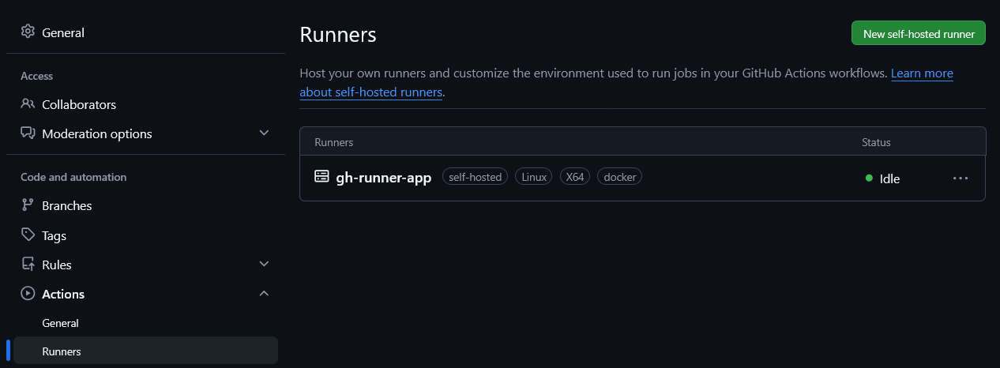

# Running a Self-hosted GitHub Actions Runner on Azure Container Instance

## Introduction

This tutorial shows how to deploy a repository-level self-hosted GitHub Actions runner on Azure Container Instances using ARM template deployment and GitHub PAT authentication.

## Theoretical Part

A self-hosted GitHub runner is infrastructure that you provision and maintain to execute GitHub Actions jobs. It can run on a physical server, virtual machine, or container. Instead of using GitHub-hosted ephemeral environments, the runner agent is installed on your own runtime, listens for jobs from GitHub, and executes them using your compute resources.

Teams typically choose self-hosted runners when they need:

- Custom environments with preinstalled SDKs, tools, or legacy dependencies.
- Secure access to internal services such as private APIs, databases, or on-premises systems.
- Better performance through persistent caches and tailored hardware profiles.
- Cost control for high-frequency or compute-heavy workflows.

### GitHub Actions runners

To execute a GitHub Actions job, you need a runner:

- GitHub-hosted runner: fully managed by GitHub.
- Self-hosted runner: managed by you.

Self-hosted runners are useful when you need custom tools, controlled networking, or stronger environment control.

### Repository-level runner scope

This tutorial is scoped to a single repository.

Set GITHUB_URL in this format:

- https://github.com/OWNER/REPO

### PAT-based registration model

This guide uses GitHub PAT only:

- GITHUB_PAT is passed as a secure parameter.
- The runner startup logic exchanges the PAT for short-lived registration and removal tokens.

Use least-privilege permissions on PAT and rotate it regularly.

### Important security notice

Self-hosted runners connect to GitHub over outbound HTTPS (port 443). You do not need inbound access from GitHub to your runner.

Do not use self-hosted runners for public repositories unless strict controls are in place. Untrusted pull requests can execute arbitrary code on your infrastructure.

Recommended controls:

- Require maintainer approval for external contributor workflows.
- Separate runner groups and labels by trust level.
- Prefer ephemeral runners to avoid state pollution between jobs.

In this ACI setup, ephemeral behavior is configured with `EPHEMERAL=true`.

### Azure Container Instances

ACI runs containers in a container group.

Key behavior relevant for this scenario:

- Fast provisioning for one-off or elastic workloads.
- CPU and memory are allocated per container group request.
- Restart policy controls whether the container is restarted after exit/failure.

## Prerequisites

Before starting the practical part, make sure you have:

- Azure subscription where runner will be deployed.
- GitHub repository where the runner will be registered.

## Practical Part

### Container deployment

For any Azure resource deployment you need a destination resource group. You can create a new one or use an existing one. After the resource group is ready, you can deploy the container instance with the ARM template.:

https://raw.githubusercontent.com/groovy-sky/azure/refs/heads/master/github-runner-00/arm.json

Easiest way to start deployment is to click the button below:

<a href="https://portal.azure.com/#create/Microsoft.Template/uri/https%3A%2F%2Fraw.githubusercontent.com%2Fgroovy-sky%2Fazure%2Frefs%2Fheads%2Fmaster%2Fgithub-runner-00%2Farm.json" target="_blank">  </a>

To be able to deploy the template you can use default parameters except Github PAT and GITHUB_URL. You can generate a new PAT in GitHub with appropriate scopes for repository runners (repo) or organization runners (admin:org). For security reasons, it's recommended to use a separate PAT just for this purpose and rotate it regularly.

The template default image is ghcr.io/groovy-sky/gh-runner:latest.

### 6. Verify runner

Open repository settings:

- Settings -> Actions -> Runners

The runner should appear online with labels from RUNNER_LABELS.

### 7. Run a test workflow

Create or trigger a workflow that targets the same labels:

```yaml
name: ACI self-hosted runner test

on:
  workflow_dispatch:

jobs:
  test:
    runs-on: [self-hosted, linux, x64, docker]
    steps:
      - uses: actions/checkout@v4
      - name: Show runner context
        run: |
          hostname
          whoami
          pwd
```

## Results

If everything is configured correctly, the ACI-based runner should appear in the repository runner list and start processing matching jobs.



Expected outcome:

- Runner is online in repository settings.
- Workflow with matching labels is picked up.
- Job steps execute inside the ACI container.

## Summary

This tutorial demonstrates a repository-level GitHub runner deployment on Azure Container Instance using PAT-only authentication and ARM template deployment.

The same pattern can be extended with custom images, stricter network controls, and autoscaling patterns for production workloads.

## Related Information

- GitHub self-hosted runners: https://docs.github.com/actions/hosting-your-own-runners
- GitHub REST API (self-hosted runners): https://docs.github.com/rest/actions/self-hosted-runners
- Azure Container Instances documentation: https://learn.microsoft.com/azure/container-instances/
- ARM template deployment with Azure CLI: https://learn.microsoft.com/azure/azure-resource-manager/templates/deploy-cli
