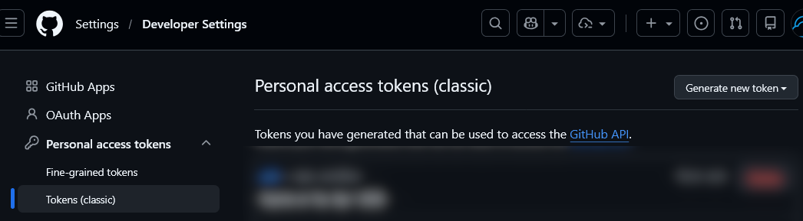
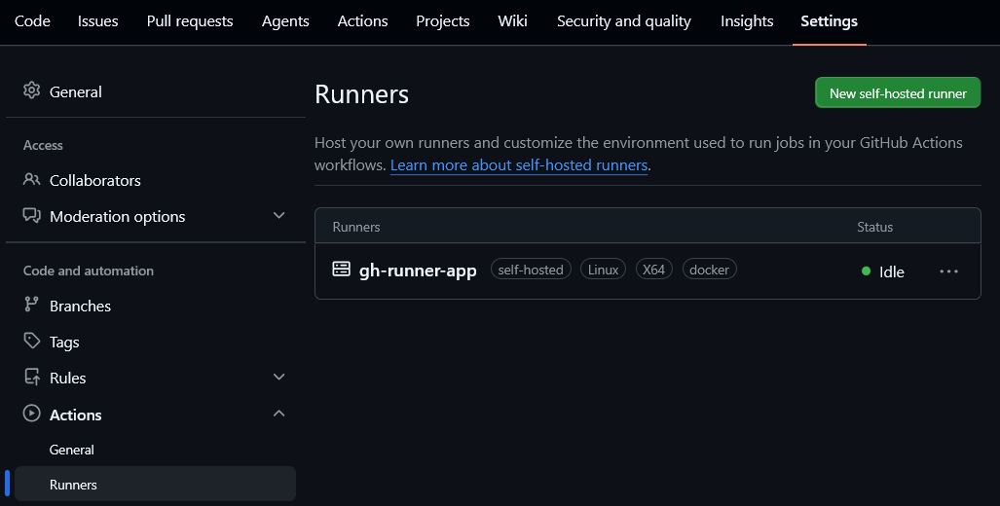
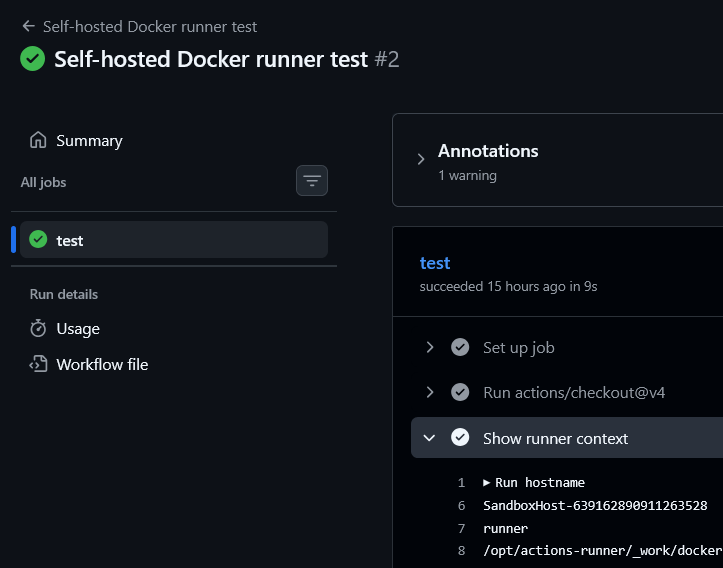

# Running a Self-hosted GitHub Actions Runner on Azure Container Instance

## Introduction

This tutorial shows how to deploy a repository‑level self-hosted GitHub Actions runner on Azure Container Instances using an ARM template and GitHub PAT authentication.

A self-hosted runner allows you to execute GitHub Actions jobs on infrastructure you control. In this guide, the runner is packaged as a container image and deployed to Azure Container Instances (ACI), which provides a simple way to run containers without managing virtual machines.

By the end of this tutorial, you will have a containerized GitHub Actions runner deployed in Azure that can execute workflows from your repository.

## Theoretical Part

### Runner architecture

To execute a GitHub Actions job, a runner must be available. GitHub supports two runner types:

- **GitHub-hosted runners** – fully managed by GitHub.
- **Self-hosted runners** – infrastructure managed by you.

Self-hosted runners are useful when you need:

- Custom environments with preinstalled SDKs, tools, or legacy dependencies.
- Secure access to internal services such as private APIs, databases, or on‑premises systems.
- Better performance through persistent caches and tailored hardware profiles.
- Cost control for high-frequency or compute-heavy workflows.

Self-hosted runners can run on a physical server, virtual machine, or container.

Instead of using GitHub-hosted ephemeral environments, the runner agent runs on your own runtime. It connects to GitHub, listens for workflow jobs, and executes them using your compute resources.

### Runner scope

Runners can be registered at two levels:

- **Repository level**: runner is available only to one repository.
- **Organization level**: runner can be shared across repositories in the organization (based on runner group access rules).

This tutorial uses **repository-level** scope by default.

For repository-level scope, `GITHUB_URL` must follow this format:

```
https://github.com/OWNER/REPO
```

### Token-based authentication

PAT and runner token are different:

- `GITHUB_PAT` is your long-lived credential (managed by you) with permission to call GitHub APIs.
- Runner registration/removal tokens are short-lived tokens generated by GitHub and used by the runner during registration or removal.

This guide uses GitHub Personal Access Token (PAT) authentication.

The PAT is passed to the container as a secure parameter (`GITHUB_PAT`). During startup, the runner exchanges this PAT for short‑lived registration and removal tokens using the GitHub API.

This approach avoids storing long-lived runner tokens inside the container.

For security reasons:

- Use a dedicated PAT only for runner registration.
- Grant the minimum required permissions.
- Rotate the token regularly.

### Security considerations

Self-hosted runners connect to GitHub using outbound HTTPS on port 443. GitHub does **not** require inbound connectivity to the runner.

However, running untrusted workflows on your infrastructure carries security risks.

Avoid using self-hosted runners for public repositories unless strict controls are implemented. Pull requests from external contributors can execute arbitrary code inside workflows.

### Azure Container Instances

Azure Container Instances (ACI) allow you to run containers without provisioning virtual machines or Kubernetes clusters.

ACI runs containers inside a **container group**, which defines the compute resources and runtime configuration.

Key characteristics relevant to this deployment:

- Fast container startup for elastic workloads
- CPU and memory allocated per container group
- Restart policy controlling container restart behavior

This makes ACI suitable for lightweight self-hosted runner deployments.

## Prerequisites

Before starting the deployment, make sure the following requirements are met.

You need:

- An **Azure subscription** where the container instance will be deployed.
- A **GitHub repository** where the runner will be registered.
- A **GitHub Personal Access Token (PAT)** with permissions required to register a runner.

Azure resources must be deployed into a **resource group**. You can create a new one or reuse an existing resource group.

## Practical Part

### PAT creation



To create a GitHub Personal Access Token (PAT) open https://github.com/settings/tokens -> Generate new token ->  Generate new token (classic) -> Give a name and select the required scopes (for repository runners, select `repo` scope) -> Generate token -> Copy the generated token and store it securely (you won't be able to see it again).

### Container deployment

Once the resource group is ready, you can deploy the container instance using the ARM template provided below.

The template creates an Azure Container Instance that runs a containerized GitHub Actions runner.

Deployment can be initiated using the Azure Portal button:

<a href="https://portal.azure.com/#create/Microsoft.Template/uri/https%3A%2F%2Fraw.githubusercontent.com%2Fgroovy-sky%2Fazure%2Frefs%2Fheads%2Fmaster%2Fgithub-runner-00%2Farm.json" target="_blank">  </a>

During deployment you can keep most parameters at their default values. The two parameters that must be provided are:

- `GITHUB_URL`
- `GITHUB_PAT`

`GITHUB_URL` should point to the repository where the runner will register.

Example:

```
https://github.com/OWNER/REPO
```

`GITHUB_PAT` must contain a GitHub Personal Access Token with appropriate permissions.

For security reasons, it is recommended to create a **dedicated PAT for runner registration** and rotate it periodically.

The container image used by default is:

```
ghcr.io/groovy-sky/gh-runner:latest
```

This image contains the GitHub Actions runner and startup logic required to register the runner automatically during container startup.

### Result

If the deployment is successful, the runner should appear in the repository's runner list.

You can verify this in GitHub:

```
Repository → Settings → Actions → Runners
```

The runner should appear online and ready to process jobs.



To test the runner, create a workflow targeting the same labels.

Example test workflow:

```
name: ACI self-hosted runner test

on:
  workflow_dispatch:

jobs:
  test:
    runs-on: [self-hosted, linux, x64, docker]
    steps:
      - uses: actions/checkout@v4
      - name: Show runner context
        run: |
          hostname
          whoami
          pwd
```

If the runner is configured correctly, the workflow will execute on the Azure Container Instance runner:




## Summary

This tutorial demonstrated how to deploy a repository-level GitHub Actions self-hosted runner using Azure Container Instances.

The deployment uses:

- a containerized GitHub runner
- PAT-based registration
- an ARM template for infrastructure provisioning

This approach provides a simple way to run self-hosted GitHub runners without managing virtual machines.

The same pattern can be extended further with:

- custom container images
- stricter network policies
- automated scaling strategies for production environments.

## Related Information

- GitHub self-hosted runners  
https://docs.github.com/actions/hosting-your-own-runners

- GitHub REST API (self-hosted runners)  
https://docs.github.com/rest/actions/self-hosted-runners

- Azure Container Instances documentation  
https://learn.microsoft.com/azure/container-instances/

- ARM template deployment with Azure CLI  
https://learn.microsoft.com/azure/azure-resource-manager/templates/deploy-cli