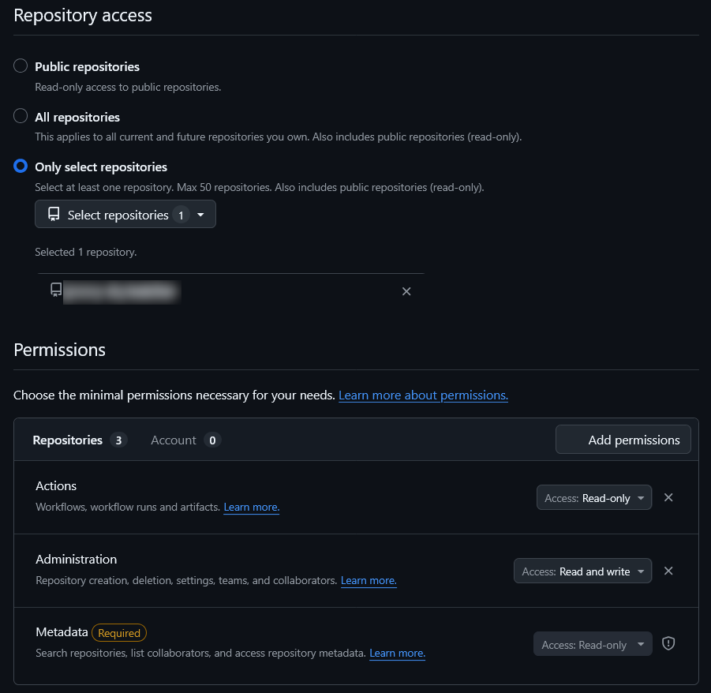
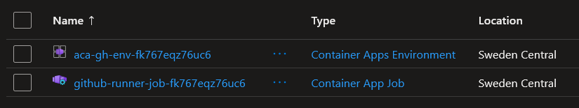
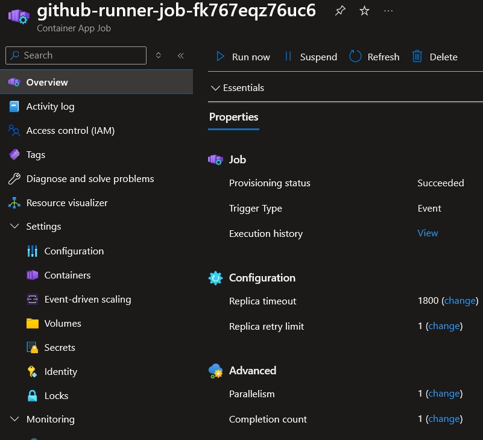

# Running Self-hosted GitHub Actions Runners on Azure Container Apps Jobs

## Introduction

This tutorial shows how to deploy **event-driven ephemeral self-hosted GitHub Actions runners** on Azure Container Apps Jobs with KEDA autoscaling.

In the [previous article](../github-runner-00/README.md), we deployed a self-hosted runner on Azure Container Instances (ACI). That setup works well and is simple to operate: one containerized runner registers to GitHub and can execute jobs for the target repository.

However, the ACI model is typically always-on, which means you may still pay for idle time when no workflows are queued. It can also become less efficient for bursty workloads, because scaling and job isolation are more limited.

This tutorial improves that situation by moving to Azure Container Apps Jobs with KEDA-based event scaling. The runners are **ephemeral**: each runner processes a single workflow job and then terminates. KEDA monitors the GitHub workflow queue and starts jobs only when work exists, then scales back to zero when the queue is empty.

By the end of this tutorial, you will have an on-demand runner platform that preserves the benefits of self-hosted runners while improving cost efficiency, workload burst handling, and per-job isolation.

## Theoretical Part

### System architecture

The solution integrates GitHub Actions, KEDA, and Azure Container Apps Jobs.

When a workflow job is queued in GitHub, KEDA detects the queue state and triggers a Container Apps Job execution. The job starts a container that runs a GitHub runner, processes a single workflow job, and exits.

Architecture overview:

```
GitHub Actions
     |
     | workflow job queued
     v
GitHub Workflow Queue
     |
     v
KEDA GitHub Runner Scaler
     |
     | queue threshold reached
     v
Azure Container Apps Job
     |
     v
Runner Container
(register → run job → deregister → exit)
```

This design is well suited for **bursty CI/CD workloads** because runners only exist when jobs are waiting in the queue.

### Runner architecture

GitHub supports two runner types:

- **GitHub-hosted runners** — fully managed by GitHub  
- **Self-hosted runners** — infrastructure managed by the user

This tutorial implements **ephemeral self-hosted runners** running inside Azure Container Apps Jobs.

Each job execution creates a new runner container that processes exactly one workflow job.

### Runner lifecycle

Each runner execution follows the same lifecycle:

1. Container Apps starts a job execution.
2. The runner container starts.
3. The runner registers with GitHub using the GitHub API.
4. GitHub assigns a queued workflow job to the runner.
5. The workflow job executes inside the container.
6. After the job completes, the runner deregisters.
7. The container exits and the job execution finishes.

Because each runner is ephemeral, every workflow job runs in a **clean environment**.

### Runner labels

GitHub schedules workflow jobs to runners using **labels**.

Workflows specify which runners they require using the `runs-on` field.

Example:

```
runs-on: [self-hosted, aca-runner-example]
```

When KEDA detects queued jobs for the configured label, it triggers a new Container Apps Job execution to start a matching runner.

The ARM template automatically generates a runner label during deployment.

### Runner scope

The template supports the following scope values:

- `repo`
- `org`
- `enterprise`

By default, deployment uses repository scope (`repo`).

For repository scope, the runtime URL is built as:

```
https://github.com/OWNER/REPO
```

### Token-based authentication

This template uses a **GitHub Personal Access Token (PAT)**.

The PAT is used for:

- polling the GitHub workflow job queue (KEDA scaler)
- requesting runner registration tokens
- removing the runner after job completion


### KEDA scaling behavior

The deployed job is configured as an **event-triggered job** with:

```
triggerType: Event
```

Key configuration parameters:

- `pollingInterval: 30`
- `targetWorkflowQueueLength`
- `minExecutions`
- `maxExecutions`
- `parallelism`

KEDA polls the GitHub workflow queue and starts Container Apps job executions when the queue length exceeds the configured threshold.

### Platform limitation

Azure Container Apps Jobs do not provide Docker-in-Docker support. Workflows that require direct Docker daemon access on the runner may fail.

### Azure Container Apps Jobs

Azure Container Apps Jobs provide event-driven container execution without managing virtual machines or Kubernetes clusters.

For this deployment pattern, relevant capabilities include:

- event-based execution through KEDA scaler rules
- scale-to-zero behavior when no events are present
- configurable parallelism and execution limits
- per-job isolated runner lifecycle

This makes Container Apps Jobs a strong fit for on-demand ephemeral self-hosted runners.


## Prerequisites

Before starting the deployment, make sure the following requirements are met.

You need:

- an **Azure subscription** where the resources will be deployed
- a **GitHub repository** where runners will be used
- a **GitHub Personal Access Token (PAT)** with permissions required for the selected runner scope

Azure resources must be deployed into a **resource group**. You can create a new one or reuse an existing resource group.

## Practical Part

### PAT creation

Before deployment, you'll need to configure PAT. This tutorial uses fine-tuned PAT. Go to https://github.com/settings/personal-access-tokens -> Generate new token

You can use a scope by your requirement. Below example of repository scope PAT:



### Container deployment

All necessary resources are created using one [ARM template](arm.json). 

You can deploy the template directly from the Azure Portal:

<a href="https://portal.azure.com/#create/Microsoft.Template/uri/https%3A%2F%2Fraw.githubusercontent.com%2Fgroovy-sky%2Fazure%2Frefs%2Fheads%2Fmaster%2Fgithub-runner-01%2Farm.json" target="_blank">  </a>

You can also deploy using Azure CLI:

```
az deployment group create \
  --resource-group <RESOURCE_GROUP> \
  --template-file arm.json \
  --parameters \
    githubOwner=<GITHUB_OWNER> \
    githubRepo=<GITHUB_REPO> \
    githubPat=<GITHUB_PAT>
```

### Result

After successful deployment a Container Apps Job is created:





#### Workflow label note

The template generates a custom label in this format:

```
aca-runner-<uniqueString(resourceGroup().name)>
```

To discover the deployed label value, query the job environment variables:

```
az containerapp job show \
  --resource-group <RESOURCE_GROUP> \
  --name <JOB_NAME> \
  --query "properties.template.containers[0].env[?name=='RUNNER_LABELS'].value" \
  -o tsv
```

Then use that value in your workflow definition.

Example workflow:

```
name: ACA runner test

on:
  workflow_dispatch:

jobs:
  test:
    runs-on: [self-hosted, <DEPLOYED_RUNNER_LABEL>]

    steps:
      - uses: actions/checkout@v4

      - run: |
          hostname
          whoami
          pwd
```

When the workflow is triggered, KEDA detects the queued job and starts a new runner container.

## Summary

This tutorial demonstrated how to deploy **ephemeral self-hosted GitHub Actions runners** on Azure Container Apps Jobs with KEDA-based autoscaling using an ARM template.

Such architecture provides an **on-demand, autoscaling runner platform** that minimizes idle infrastructure while maintaining full control over the runner environment.

## Related Information

- GitHub self-hosted runners  
https://docs.github.com/actions/hosting-your-own-runners

- GitHub REST API (self-hosted runners)  
https://docs.github.com/rest/actions/self-hosted-runners

- KEDA GitHub runner scaler  
https://keda.sh/docs/2.20/scalers/github-runner/

- Azure Container Apps Jobs documentation  
https://learn.microsoft.com/azure/container-apps/jobs

- ARM template deployment with Azure CLI  
https://learn.microsoft.com/azure/azure-resource-manager/templates/deploy-cli