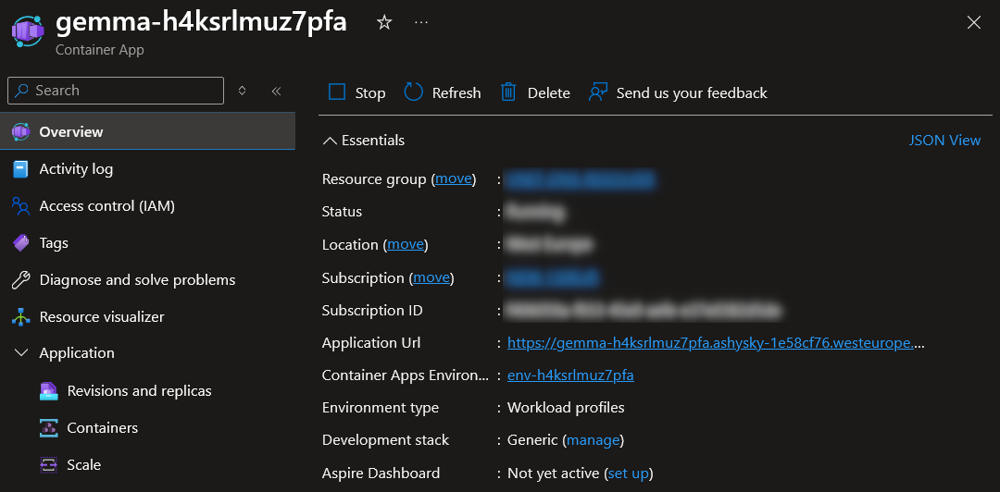
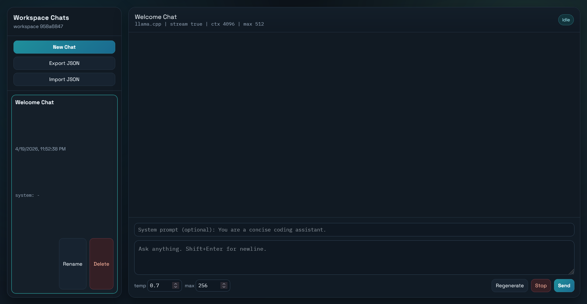
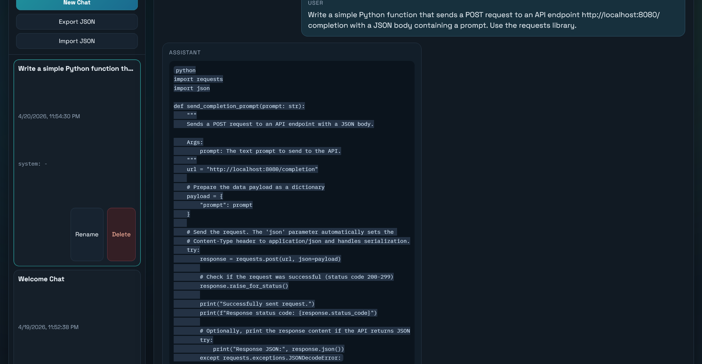
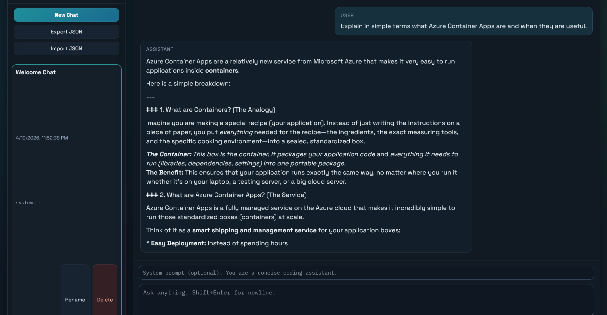

# Running a Self‑Hosted LLM on Azure Container Apps

## Introduction

Microsoft Foundry offers a powerful managed platform for building AI applications and agents. That said, there are situations where it introduces practical constraints, such as:

- model availability limited by region or subscription  
- quota limits  
- pricing complexity  
- limited control over low‑level inference behavior  

When you need tighter control over the model runtime—or want to use open‑source models that aren’t available in Foundry—it can make sense to run your own LLM inference stack directly on Azure infrastructure.

This guide walks through deploying and running a **self‑hosted LLM service using Azure Container Apps**.

The goal is not only to run a model, but also to understand what actually happens inside a lightweight inference stack. Before jumping into the deployment, it helps to look at a few core ideas behind how language models generate text and how efficient runtimes like `llama.cpp` make it possible to run them in small cloud environments.

## Theory

Large Language Models (LLMs) are neural networks trained to understand and generate human language. They learn by processing very large text datasets and discovering statistical patterns in how words and phrases appear together.

At their core, most modern LLMs are based on the **transformer architecture**. Instead of reading text word‑by‑word like older models, transformers process tokens in parallel and use a mechanism called **attention** to determine which parts of the input are most relevant when generating the next token.

### Tokens and Text Generation

LLMs do not operate directly on words. Text is first converted into **tokens**, which are small pieces of text such as words, sub‑words, or characters.

For example:

```
"Azure runs AI models"
```

might become something like:

```
["Azure", " runs", " AI", " models"]
```

The model receives these tokens and predicts the **most probable next token** based on everything that came before it. This process repeats token by token until a full response is produced.

In other words, an LLM is essentially a system that repeatedly answers the question:

“Given this text so far, what token is most likely to come next?”

Despite the simplicity of this mechanism, the scale of training data and model parameters allows LLMs to produce surprisingly coherent and useful responses.

### Inference vs Training

There are two major phases in the life of an LLM.

#### Training

During training the model learns from massive datasets using large GPU clusters. This stage adjusts billions of internal parameters so the model can predict tokens accurately.

#### Inference

Inference is the stage where the trained model is used to generate responses. Instead of learning, the model simply performs forward passes through the neural network to produce tokens.

Running inference is still computationally heavy, but it is far cheaper than training and can often be done on CPUs or modest GPU instances depending on the model size.

The system described in this guide focuses entirely on **inference**, using an already trained model.

### Quantization and Model Formats

Raw models are often extremely large and designed for high‑end GPU systems. To run them on smaller machines, the weights can be **quantized**, meaning their numerical precision is reduced.

Common benefits of quantization include:

- smaller model size  
- lower memory usage  
- faster inference  
- ability to run on CPUs  

Many open models are distributed in the **GGUF format**, which is optimized for efficient loading and execution in lightweight inference runtimes.

### llama.cpp

`llama.cpp` is a lightweight open‑source inference engine designed to run LLMs locally.

Despite the name, it supports many models beyond the original LLaMA family, including models such as **Gemma, Mistral, and others**, as long as they are provided in **GGUF format**.

Its main responsibilities are:

- loading the model weights into memory  
- managing tokenization and sampling  
- running transformer inference computations  
- generating tokens one at a time  
- exposing an API that other services can call  

Internally, llama.cpp is written in C/C++ and focuses heavily on performance optimizations such as:

- CPU vectorization  
- efficient memory mapping of model files  
- optional GPU acceleration  
- support for quantized models  

Because of these optimizations, llama.cpp can run reasonably capable models even on machines without GPUs.

### Token Streaming

When generating text, the model produces tokens sequentially. Instead of waiting for the full response, systems often **stream tokens as they are generated**.

This provides two advantages:

- users see the response appear gradually in real time  
- latency feels much lower for interactive chat  

In the architecture used in this guide, the browser receives these streamed tokens through **Server‑Sent Events (SSE)** while `llama.cpp` is generating the response.

## Architecture

With these concepts in mind, the deployment becomes much easier to understand.

The system used in this guide is intentionally simple. It packages all components needed to run inference into a single container that runs inside **Azure Container Apps**.

The stack consists of three main parts:

- **llama.cpp runtime** – loads the quantized Gemma model and performs inference  
- **NGINX gateway** – exposes an HTTP endpoint and serves the browser interface  
- **browser client** – sends prompts and renders streamed responses

The browser sends a prompt to the HTTP endpoint. NGINX forwards the request to the `llama.cpp` server running inside the container. As the model generates tokens, they are streamed back to the browser using Server‑Sent Events.

The entire system runs as a containerized service deployed through Azure Container Apps.

All materials for this setup are stored in the repository:

https://github.com/groovy-sky/local-ai

The repository contains:

- container configuration  
- runtime setup for `llama.cpp`  
- NGINX configuration  
- a minimal browser client  

For convenience, a prebuilt container image is also available:

https://hub.docker.com/repository/docker/gr00vysky/gemma4-e2b

This image bundles the dependencies required to run the inference service, allowing it to be deployed directly to Azure without additional build steps.

### Why Gemma‑4 E2B Works Well Here

The **Gemma‑4 E2B** model fits this setup well because it is designed to run efficiently on modest hardware.

Key characteristics:

- **Compact model tier** — the E2B variant belongs to the lightweight Gemma model family and can run on CPU‑based infrastructure without requiring GPU instances.  
- **GGUF compatibility** — when converted to GGUF format, Gemma models run directly with `llama.cpp`.  
- **Predictable resource usage** — the model fits within the CPU and memory limits typically available in Azure Container Apps.  
- **Good fit for small workloads** — with conservative container sizing and some runtime tuning, a single instance can support a small internal user base.

With the architecture and model choice explained, the next step is deploying the containerized inference service.

## Deployment

### Prerequisites

To run the deployment, you will need an active Azure subscription

### Deployment Guide

Use the following **Deploy to Azure** link to deploy the ARM template directly from GitHub:

<a href="https://portal.azure.com/#create/Microsoft.Template/uri/https%3A%2F%2Fraw.githubusercontent.com%2Fgroovy-sky%2Flocal-ai%2Frefs%2Fheads%2Fmain%2Farm.json" target="_blank">
  
</a>

The template creates the Azure resources required to run the container and configures Azure Container Apps to start the inference service.

Once the deployment finishes, Azure will start the container and expose a publicly reachable endpoint for the web interface and the proxied inference API.



## Result

After deployment completes, the containerized stack will already be running:



Opening the endpoint in a browser should display the chat interface served by NGINX. When a prompt is submitted, it is forwarded to the `llama.cpp` runtime, which generates tokens and streams them back to the browser.

You should now have:

- a self‑hosted **Gemma‑4 E2B inference service** running on Azure Container Apps  
- a browser‑based chat interface exposed through NGINX  

This confirms that the containerized inference stack is working correctly in the Azure environment.

### Playground

After deployment, the web interface can be used to send prompts directly to the running model. This provides a quick way to validate that the inference service is working and to observe how the model responds to different types of tasks.

#### First example



In this example, the model generated a small Python helper function that sends a prompt to an API endpoint using the requests library. The response includes basic error handling and demonstrates how the request payload can be sent as JSON.

This type of output is typical for developer‑focused models and illustrates how the deployed service can assist with small programming tasks or API integrations.

#### Second example



Here the model demonstrates a different capability: explaining technical concepts in simple language. The response summarizes what containers are, how Azure Container Apps manages infrastructure, and typical scenarios where the service is useful.

## Summary

Managed platforms like **Microsoft Foundry** simplify many aspects of building AI applications, but they also abstract away the underlying model runtime and restrict control over model selection and infrastructure.

In this guide, we took a different approach by deploying a **self‑hosted LLM inference stack on Azure Container Apps**.

Using a lightweight runtime (`llama.cpp`), a quantized **Gemma‑4 E2B** model, and a small NGINX gateway, we built a compact system capable of running an open‑weight language model entirely on Azure infrastructure.

While much simpler than large AI platforms, this setup demonstrates the core mechanics of how modern LLM systems generate text and provides a flexible foundation for experimenting with open models or building internal AI tools.